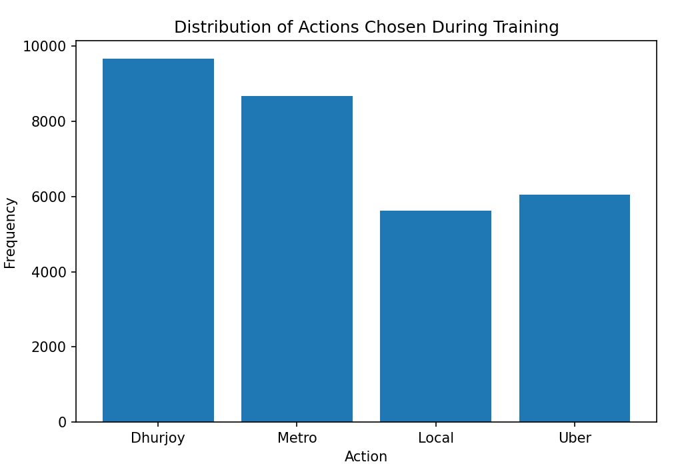
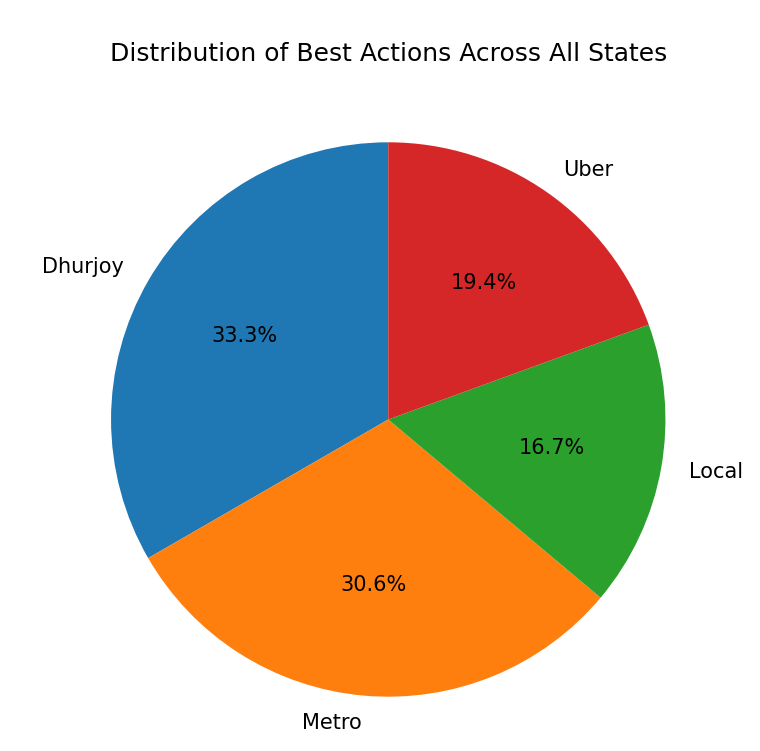
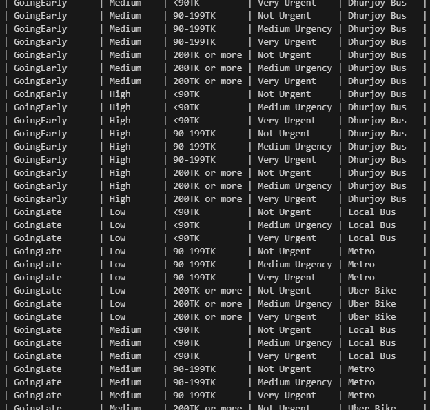

# Reinforcement Learning for Transportation Decision Making for going University

### Scenario Context: Journey of Mohammadpur ↔ Jagannath University (Sadarghat)

I travel between my home in Mohammadpur and JnU in Sadarghat under varying conditions:
- **Transportation Modes:**
  - **Dhurjoy (University) Bus:** Free, but only available early morning to JnU (~1 hr) and returns at 3:30 PM (~1.5 hrs).
  - **Metro Rail Route (if missing Dhurjoy or returning early):** Bus to Farmgate (10 TK, 15 mins) → Metro to Motijheel (30 TK, 10 mins) → Rickshaw to Sadarghat (50 TK, 25 mins). Total ~90 TK, ~50 mins.
  - **Local Buses:** Cheaper (~30 TK total) but can be slow and affected by traffic, especially around Gulistan.
  - **Uber Bike:** Fastest option if urgent and you have enough money (≥200 TK).

- **Conditions Affecting Decisions:**
  - **Time Scenario:** Early (Dhurjoy Bus), Late (Metro/Uber if urgent), Return trips (Dhurjoy after 3:30 PM, Metro or Uber if early and urgent).
  - **Traffic Levels:** High traffic favors Metro or Uber to save time.
  - **Money Levels:** Low funds push towards Dhurjoy or Local Bus; sufficient funds allow Metro or Uber.
  - **Urgency:** Higher urgency increases preference for faster but more expensive options (Uber Bike or Metro).

The code uses Q-learning to learn the best action (transport mode) for each combination of time, traffic, money, and urgency, aiming to minimize travel time and cost (negative rewards) and choose the most efficient means of travel.

This project applies Q-learning to select transportation options under various conditions. The agent learns an optimal policy that balances **time**, **cost**, and **urgency**.

## Overview

**Scenario:**  
You need to choose the best mode of transportation (from Dhurjoy Bus, Metro, Local Bus, or Uber Bike) under specific scenarios that vary by:
- Time scenario:  
  - Going Early (0)  
  - Going Late (1)  
  - Return Before 2PM (2)  
  - Return After 2PM (3)

- Traffic level:  
  - Low (0)  
  - Medium (1)  
  - High (2)

- Money level:  
  - `<90 TK` (0)  
  - `90-199 TK` (1)  
  - `≥200 TK` (2)

- Urgency:  
  - Not Urgent (0)  
  - Medium Urgency (1)  
  - Very Urgent (2)

The agent observes a state `(TimeScenario, TrafficLevel, MoneyLevel, Urgency)` and chooses an action `(Dhurjoy Bus, Metro, Local Bus, Uber Bike)`.

## State and Action Representation

- **State:** A combination of the factors `(TS, TF, M, U)`.
  - `TS` in {0, 1, 2, 3}  
  - `TF` in {0, 1, 2}  
  - `M` in {0, 1, 2}  
  - `U` in {0, 1, 2}

  Total number of states = 4 (time scenarios) * 3 (traffic levels) * 3 (money levels) * 3 (urgency levels) = 108 states.

- **Actions:**  
  - 0: Dhurjoy Bus  
  - 1: Metro  
  - 2: Local Bus  
  - 3: Uber Bike

## Reward Function

The reward is calculated based on the chosen action’s **time** and **cost**, weighted by **urgency**. The general form is:

$$
\text{Reward} = - \bigl( (A_{\text{time}} \times (1 + \text{Urgency})) \times \text{Time} + A_{\text{cost}} \times \text{Cost} \bigr)
$$

Where:
- \( A_{\text{time}} \) and \( A_{\text{cost}} \) are scaling factors for time and cost.
- Urgency scales the time penalty: 
  - Not Urgent (0) → multiplier = 1  
  - Medium Urgency (1) → multiplier = 2  
  - Very Urgent (2) → multiplier = 3

**Example:**
- If \( A_{\text{time}} = 0.1 \) and \( A_{\text{cost}} = 0.01 \):
  - For Urgency = 0 (Not Urgent), Time = 30, Cost = 0:  
    $$
    \text{Reward} = -((0.1 \times (1+0)) \times 30 + 0.01 \times 0) = -(3 + 0) = -3.0
    $$

  - For Urgency = 2 (Very Urgent), Time = 30, Cost = 200:  
    $$
    \text{Reward} = -((0.1 \times (1+2)) \times 30 + 0.01 \times 200) 
    = -((0.1 \times 3) \times 30 + 2) 
    = -((0.3 \times 30) + 2) 
    = -(9 + 2) 
    = -11.0
    $$

**Note:** The rewards are often negative because they represent penalties (time and cost). The goal in RL is to find a policy that minimizes these penalties (thus maximizing reward, which means making the reward “less negative”).

## Negative Rewards

Having negative rewards is completely normal in reinforcement learning:
- The reward function does not need to be strictly positive.  
- Negative rewards can signify costs, delays, or undesirable actions.  
- The agent's objective is to maximize the cumulative reward, which effectively means minimizing these negative outcomes.

Over time, the agent learns to choose actions that lead to smaller penalties (less negative rewards), thus improving its performance.

## Learning Algorithm: Q-Learning

The agent uses **Q-learning**, an off-policy Temporal Difference (TD) method, to estimate the Q-values for each state-action pair. After training:
- It selects the action with the highest Q-value in each state.
- Epsilon-greedy exploration ensures the agent tries various actions, especially early in training.

**Key Parameters:**
- **Alpha (α):** Learning rate.
- **Gamma (γ):** Discount factor for future rewards.
- **Epsilon (ε):** Exploration rate, which decays over time.

## Visualization

The code includes visualizations to understand the learning process:
- Rolling average reward plot to track learning progress.
- Q-table heatmap to inspect learned Q-values.
- Action distribution histogram to see which actions are chosen frequently.
- Policy and result comparisons for different test scenarios.

The code includes visualizations to understand the learning process:

### Distribution of Actions Chosen During Training

### Distribution of Best Actions Across States

### Q-Table Heatmap

### Policy Visualization

## Running the Code

1. Install required libraries: `numpy`, `matplotlib`, `seaborn`, `tabulate`.
2. Run the Python script to train the agent and generate results.
3. Inspect the printed policy table, charts, and test scenario outputs.

## Adjustments

- You can modify the reward equation by changing \( A_{\text{time}} \), \( A_{\text{cost}} \), or the urgency weighting.
- Adjust epsilon decay or the number of episodes to affect convergence speed.
- Introduce different penalties or constraints to shape the policy learned by the agent.

## Testing the Agent

The agent can be tested on various scenarios to evaluate its performance. The testing function allows you to input specific states and observe the chosen action, time, cost, and reward. Additionally, you can batch test all states to compute the average reward for the best actions across all states.
